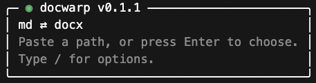

> Agentic CLI Usage References:
> 1. [`AGENTS.md`](AGENTS.md) as the canonical hub for agents using the `docwarp` CLI.
> 2. `README.md` (this file) for commands and conversion flow.
> 3. [`docs/strict-mode.md`](docs/strict-mode.md) for CI/quality gates.

`docwarp` is an open-source Rust CLI for **Markdown ↔ DOCX** conversion.

- **Agent Friendly:** CLI with instructions for agentic usage.
- **Bidirectional:** `md ⇄ docx` with round-trip reliability.
- **Math/Equations:** native Word equations for scientific notation and statistics.
- **Preserved Styles:** headings, nested/mixed lists, tables, images, blockquotes, etc.
- **Simple UX:** guided mode with path pick/drag and auto conversiondirection.
- **Batch + automation ready:** directory input + `--glob`, config files, and optional JSON conversion reports.
- **Word style control:** template + style-map support, `h1`-`h6` heading-style fidelity, and template style-map extraction (YAML/JSON).

## Install (Homebrew)

```bash
brew install n10elabs/tap/docwarp
```

## Current Status

`v0.1.0` is available and supports:

- `docwarp md2docx` for Markdown -> DOCX
- `docwarp docx2md` for DOCX -> Markdown
- guided mode when run without arguments
- warning-first conversion with optional `--strict` exit behavior
- optional JSON conversion reports
- config file + style-map support
- batch conversion via directory input + `--glob`
- native Word equation round-tripping for `$...$` and `$$...$$` with equation style-map tokens

## Quick Start

```bash
docwarp md2docx ./input.md --output ./output.docx
docwarp docx2md ./input.docx --output ./output.md
```

Guided mode:

- Run `docwarp` with no arguments.
- Choose a file/folder interactively (or drag a path into the terminal).
- Type `/` for session options (template, remote images, backup enabled, backup max count, backup directory).
- `docwarp` auto-detects direction and runs the matching conversion.

## Commands

```text
docwarp
docwarp md2docx <input.md|input_dir> --output <output.docx|output_dir> [--glob <pattern>] [--template <template.dotx>] [--style-map <map.yml>] [--config <docwarp.yml>] [--report <report.json|report_dir>] [--strict] [--allow-remote-images] [--no-backup] [--backup-dir <dir>] [--backup-keep <n>]
docwarp docx2md <input.docx|input_dir> --output <output.md|output_dir> [--glob <pattern>] [--assets-dir <dir>] [--style-map <map.yml>] [--config <docwarp.yml>] [--report <report.json|report_dir>] [--password <secret>] [--strict] [--no-backup] [--backup-dir <dir>] [--backup-keep <n>]
docwarp template-map <template.dotx|template.docx> [--output-dir <dir>] [--name <stem>]
```

## Overwrite Backups

- If the output file already exists, `docwarp` creates a timestamped backup before overwrite, keeping the output's native file extension.
- Default backup location is a sibling `docwarp_backups/` directory next to the output file.
- Use `--no-backup` to disable backups.
- Use `--backup-dir <dir>` to override the backup location.
- Use `--backup-keep <n>` to retain only the latest `n` backups per output file.

Batch mode:

```bash
docwarp md2docx ./docs --output ./build/docx
docwarp docx2md ./contracts --output ./build/md --glob "**/*.docx"
```

Template style-map extraction:

```bash
docwarp template-map ./styles/brand.dotx --output-dir ./styles
# writes ./styles/brand-style-map.yml and ./styles/brand-style-map.json
```

## Password-Protected DOCX

- `docwarp docx2md` supports password-protected DOCX files with `--password`.
- Decryption uses an auto-managed Python runtime for encrypted Office containers.
- On first encrypted conversion, `docwarp` bootstraps a private venv under `$DOCWARP_HOME` (or platform data dir), installs pinned `msoffcrypto-tool`, and verifies the wheel hash before use.

Run command-specific help for detailed examples:

```bash
docwarp --help
docwarp md2docx --help
docwarp docx2md --help
```

## Docs

- Install guide: `docs/install.md`
- Configuration and style maps: `docs/configuration.md`
- Agent instruction hub (canonical): `AGENTS.md`
- Strict mode and CI guidance: `docs/strict-mode.md`
- JSON report schema: `docs/report-schema.md`
- Warning code catalog: `docs/warnings.md`
- Homebrew/core submission guide: `docs/homebrew-core.md`
- Release runbook: `docs/release.md`
- Changelog: `CHANGELOG.md`

## License

Apache-2.0
